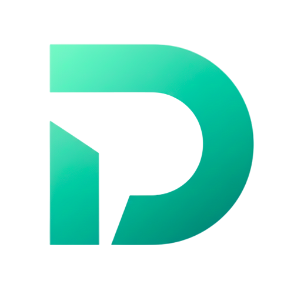

  
  
  # KnotX Contracts
  
  **Smart contracts for cross-chain messaging**

## Contracts

KnotX consists of four main contracts: two gateway contracts and two receiver contracts.

### Gateway Contracts

Gateway contracts handle message sending and receiving across chains.

#### Ethereum Sepolia Gateway
**Address:** `0xe6F75A8E2d21EeFD33A5ecA76215bB20DbE0bb1F`

#### Casper Testnet Gateway
**Address:** `hash-4ce6b9ec80fde0158f7ab13f37cff883660048c1d457e9e48130cc884ce83073`

### Receiver Contracts

Receiver contracts implement the `IKnotXReceiver` interface to receive and process cross-chain messages.

#### Ethereum Sepolia Receiver (UniversalCounter)
**Address:** `0xD3B1c72361f03d5F138C2c768AfdF700266bb39a`

#### Casper Testnet Receiver (UniversalCounter)
**Address:** `hash-2ede3272d048e81c344c68f65db55141e1132d70da6443770ac0de443534d36e`

